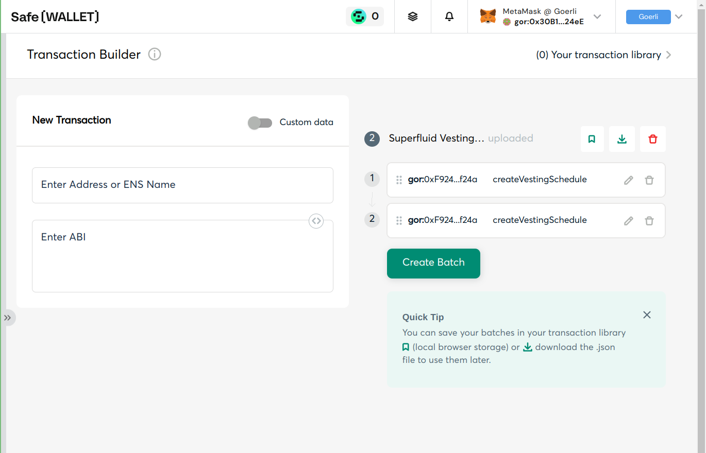

# About

This repo contains helpers for batching the creation of many Superfluid Vesting Schedules from a (Gnosis) Safe into one transaction.  

The application was tested with nodejs v18.  
Do `yarn install` in order to get dependencies installed.

## Data source

The data is loaded from a csv file. Here's an example with 2 items:
```
token,receiver,flowRate,startTs,cliffTs,cliffAmount,endTs
0x8ae68021f6170e5a766be613cea0d75236ecca9a,0xa87fb5f93f76aac7573559eca1fa27610e7efb15,3805175038,1692539417,0,0,1724075417
0x8ae68021f6170e5a766be613cea0d75236ecca9a,0xeece40e5bb700335c0bc66d09ba9c6c859dd7125,3805175038,1692539417,0,0,1724075417
```

You can generate such csv files with whatever tool you prefer.

Bundled is a simple generator script for creating sample csv files. Example invocation for creating a file `batch.csv` describing 2 vesting schedules:
```
node create-sample-csv.js batch.csv 2
```
This generator script creates items with the same vesting parameters, only the receiver (randomly generated addresses) changes.  
You can override the other parameters with env vars, see the script's source code.

If you want to execute such a test batch on another chain than goerli, you need to override the token address (you can find SuperToken addresses in the [Superfluid Console](https://console.superfluid.finance/matic/supertokens)).

## create-txbuilder-json.js

This script transforms a csv file as described above to a json file which can be loaded by the [Safe Transaction Builder](https://help.safe.global/en/articles/40841-transaction-builder).

Required arguments are the chainId where the transactions shall be executed, and the path to the csv file.

Example invocation:
```
node create-txbuilder-json.js 5 batch.csv
```
This will create a file `batch.json` which can be executed by a Safe on Goerli (chainId 5).  
The output filename is always the same as the input file, but with `.json` suffix.

After creating the json file, you can import it into your Safe Transaction builder with drag'n drop or file selector:


Then confirm with "Create Batch":


Next you can review the included transactions by clicking the expand arrow:


Next you can _Simulate_ the transaction in order to check if it would succeed, and finally propose it to the multisig by clicking _Send Batch_.  
From here on, the process is the same as with any other Safe transaction: collect enough signatures and execute.

Note that there's a limit to the batch size, although it's not yet clear what it is.  
A test with 100 vesting schedules per batch were successful while a test with 200 schedules failed (Safe didn't accept the tx, probably due to the calldata size exceeding some limitation).

## propose-multicall.js

This script requires a private key which is co-owner of the sender Safe. It uses [Multicall3](https://github.com/mds1/multicall) for batching.  
It creates the transaction data, signs it and proposes it for co-signing and execution using the Safe transaction service.

A csv file containing vesting schedules must be provided as argument.  
The env arguments `RPC` (url), `SAFE` (address) and `PRIVKEY` (private key of one of the Safe signers) must also be set.

Example invocation:
```
RPC=https://rpc.ankr.com/eth_goerli SAFE=0x18A6dBAA09317C352CAd15F03A13F1f38862d124 PRIVKEY=fd63bf5836257048dbdc0d28566cfbb7276c847225b3c16ffe9d04d88009e800 node propose-multicall.js batch.csv
```

At the end of the script's output you get an URL of the Safe App where to sign and execute the transaction.

Note that Safe transactions created this way may show a warning "Unexpected delegate call" in the Safe UI. That's because for batching with Multicall to work, the Safe must be instructed to do a delegatecall to the Multicall contract. Otherwise the msg.sender of the individual calls to the Vesting Scheduler would be the Multicall contract, not the Safe contract, and it would fail.

With this method, a batch of 200 vesting schedules succeeded: https://goerli.etherscan.io/tx/0x7abe16abb948137a7f2ede0e75694121dff77feca9a87b76118efef7b52277b3  
Note that the gas used here was slightly above 8M. That should give you a good idea for what batch size fits into a tx based on the block gas limit of the chain.